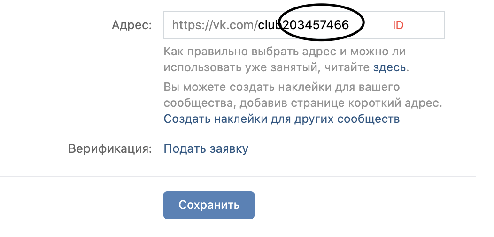
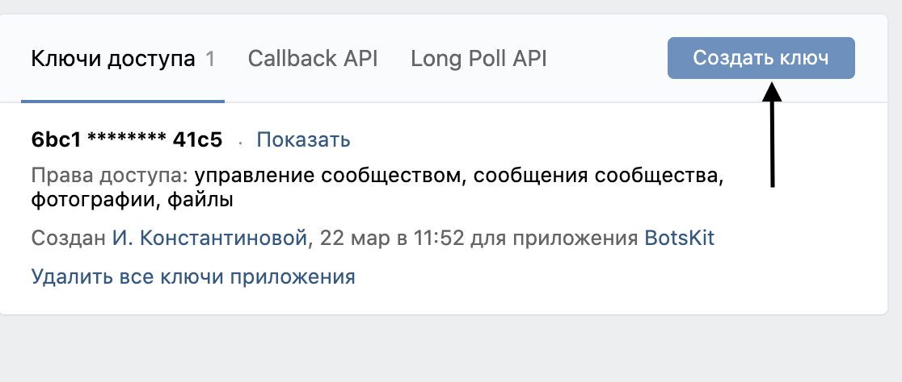

## Get an ID group in your group settings


## Create an access token 


## Add Maven dependency:
```xml
<repositories>
   <repository>
      <id>vk_api_javastream-mvn-repo</id>
	  <url>https://raw.github.com/JavaStream/vk_api_javastream/mvn-repo/</url>
		 <snapshots>
		     <enabled>true</enabled>
			  <updatePolicy>always</updatePolicy>
		 </snapshots>
   </repository>
</repositories>

<dependency>
    <groupId>com.javastream</groupId>
    <artifactId>vk_api_javastream</artifactId>
    <version>0.4-SNAPSHOT</version>
 </dependency>
  ```

## Create connection and start updates with VK Server
Create Spring boot project and 2 classes. See example in the folder `examples`. First class is the `Connect`
```java
@Component
public class Connect {

    @Autowired private UpdateProcessService updateProcessService;

    private Messager messager = null;

    private void start() {
        int groupId = 203457466;
        String accessToken = "6bc146e2f6f4939e93bb872e66c751fe410aa79abc9add5f3d5c76d2faf0e779363fd1dab1e8ffb4d41c5";

        Client client = new Client(groupId, accessToken);
        VkStarter vkStarter = client.initService();
        VkMessenger vkMessenger = client.getMessanger(vkStarter);


        messager = message -> {
            updateProcessService.update(vkMessenger, message);
            return message;
        };

        try {
            vkStarter.startUpdates(messager);
        }catch (NullPointerException e){
            System.out.println("Catch");
        }
    }


    @PostConstruct
    private void run() {
        start();
    }
}
```

## Create your service for processing messages from VK
Second class in the `folder` is the `UpdateProcessService`. He is responsible for processing incoming messages.
```java
@Service
public class UpdateProcessService {

    public void update(VkMessenger vkMessenger, Message message) throws ClientException {

        if (message.getText().contains("Hello")) {
            vkMessenger.sendMessage("Hello my friend!", message);
        }

        if (hasText(message)) {
            System.out.println("has Text");
        }

    }

    public static boolean hasText(Message message) {
        return !message.getText().isEmpty();
    }
}
```